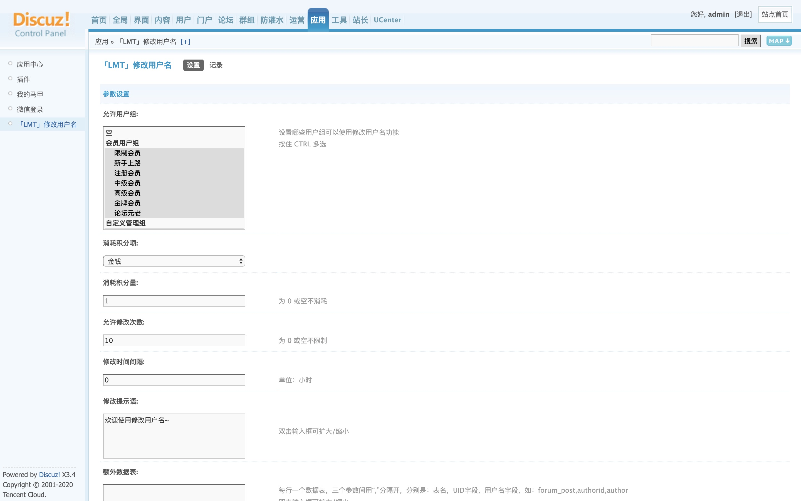
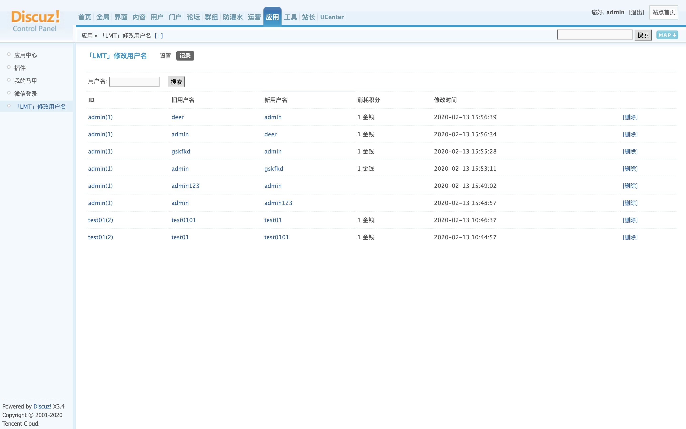
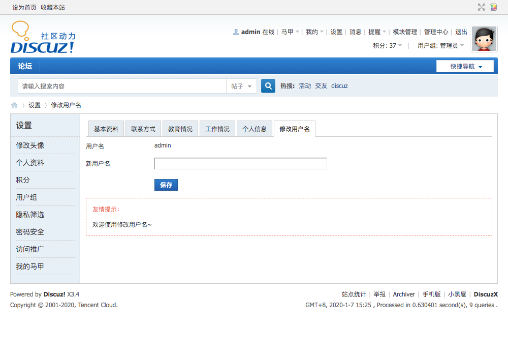
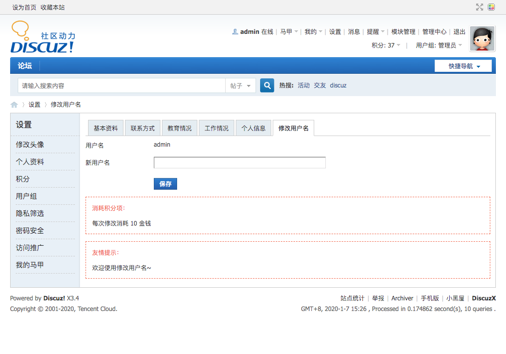
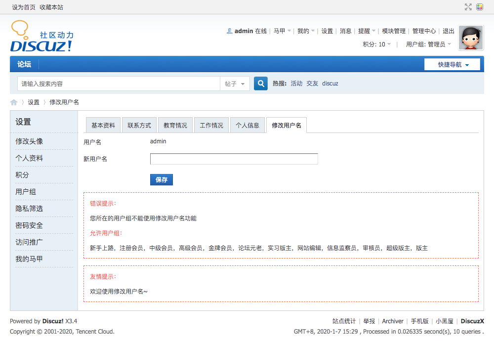
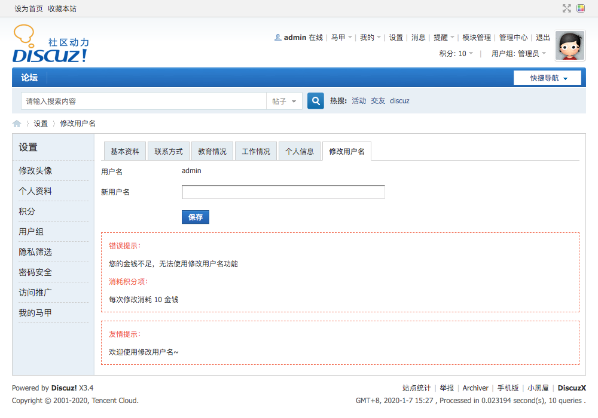

# DZX 插件 - 修改用户名

## 安装步骤

下载 zip 包，将 `lmt_rename` 文件夹上传到 `source/plugin` 目录即可。

## 插件介绍

1. 支持限定允许用户组
2. 支持积分消耗
3. 支持限定修改次数
4. 支持限定时间间隔
5. 支持自定义提示语
6. 支持扩展数据库、数据表
7. 支持查询修改用户名记录

## 特别说明

因为修改用户名直接修改数据表，仅支持 Discuz 论坛的数据库账号有权操作 UCenter 表的情况。

扩展数据库、数据表同理。

## 界面截图

